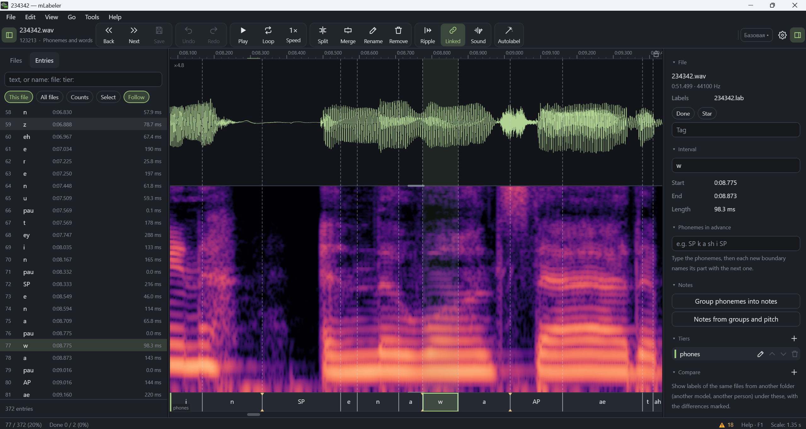

# mLabeler

歌声数据标注编辑器：音素层与单词层、音符与音高、UTAU oto。
同一套代码支持 Windows、macOS、Linux、Android 和 iOS（Kotlin，Compose Multiplatform）。

[English](README.md) · 中文 · [Русский](README.ru.md)



## 下载

所有平台的安装包均位于 [Releases](https://github.com/Megageorgio/mlabeler/releases) 页面：

- **Windows**：免安装 `.zip`（解压后运行 `mLabeler.exe`）或 `.msi` 安装程序；
- **macOS**：`.dmg`；
- **Linux**：适用于 Debian 和 Ubuntu 的 `.deb`，或适用于任何发行版的 `.tar.gz`（解压后运行 `bin/mLabeler`）；
- **Android**：`.apk`；
- **iOS**：未签名的 `.ipa`（见下文）。

### 系统要求

| 系统 | 最低要求 |
|---|---|
| Windows | Windows 10 或 11，64 位 |
| macOS | macOS 12 或更高版本，搭载 Apple 芯片（M1 及更新）的 Mac |
| Linux | 较新的 64 位（x86-64）发行版 |
| Android | Android 8.0 或更高版本 |
| iOS / iPadOS | iOS 15 或更高版本：iPhone 6s、iPhone SE（第一代）及更新机型；iPad（第五代）、iPad Air 2、iPad mini 4 及更新机型 |

自动标注（工具包）需要一台运行 Windows 10+、macOS 或 Linux 的电脑。手机和平板可以使用同一网络中电脑上的工具包。

发布分为三个渠道：**稳定版**、**测试版**（更早获得新功能）和 **Alpha 版**（最新的开发版本）。
程序可在启动时检查新版本，下载前始终会先询问；渠道可在首次启动时或在“设置 → 关于”中选择。
在 Android 上，新的 `.apk` 下载后由系统安装程序覆盖安装旧版本，设置会保留。

**iOS** 提供未签名的 `.ipa`。可使用 [AltStore](https://altstore.io)、[SideStore](https://sidestore.io)、Sideloadly 或 TrollStore 安装，它们会用您自己的 Apple ID 签名。使用免费 Apple ID 时签名有效期为 7 天，需要续签（AltStore 和 SideStore 会自动续签）。程序不会自动安装 iOS 更新，而是提示有新版本并打开发布页面。在 iOS 上，程序使用自身的“文稿”文件夹，该文件夹可在“文件”应用中看到。

Android 会请求访问所有文件，因为标注文件会写入所打开文件夹中录音的旁边。

## 功能

**标注**
- 打开包含录音的文件夹，自动找到旁边的标注：`.lab`、`.TextGrid`、Audacity 标签、DiffSinger `.ds`
  与 `transcriptions.csv`、UTAU `oto.ini`。可导入 vLabeler 项目（`.lbp`）。
- 音素层与单词层：用鼠标、手指或按键移动边界；拆分、合并、重命名；连锁移动与联动边界；
  在整个文件夹中批量重命名。
- 波形、频谱图、音高、响度以及可选的共振峰，可分开显示，也可叠加在同一画面中。
- 检查常见错误（过短或空的片段、未知音素、会导致 DiffSinger 训练失败的问题），
  “已完成”与星标、筛选器和文件夹树。
- 与其他文件夹中的标注进行比较，并给出差异统计。

**音符与音高**
- 钢琴卷帘：按音素分组生成音符、绘制音高、对齐调内音、MIDI。
- 使用绘制的音高试听（WORLD 或 DiffSinger 声码器）。
- 导出 DiffSinger 数据集（`wavs/` + `transcriptions.csv`），长录音可在停顿处切分。

**声音**
- 声音编辑模式，标注在此模式下被锁定：剪切、静音、标准化、淡入淡出、修剪两端静音、
  修复爆音和降噪。所有更改均可撤销，原始文件会被保留。

**oto 与录音**
- oto 编辑器，支持为 CV / VCV / CVVC 音源自动生成 oto。
- 按录音表录音，带电平表、节拍器和参考音轨。

**自动标注**
- 通过独立的辅助程序 [mVocalToolkit](https://github.com/Megageorgio/mVocalToolkit)：按歌词或音素对齐、
  无歌词标注、从录音识别歌词、切分。
- 在电脑上，mLabeler 会在需要时自动安装并启动工具包。正在运行的工具包由所有使用它的程序共享，
  当不再有程序需要它时会自动关闭。手机和平板可以使用同一网络中电脑上的工具包。

**界面**
- 工作环境（预设的面板、轨道和按钮组合）、可编辑所有颜色的主题、可重新绑定的按键和鼠标按键、
  命令列表（Ctrl+K）、可搜索的设置和帮助（F1）。
- 可在所有平台上运行的 JavaScript 插件。
- 界面语言：英语、俄语、日语、简体中文、韩语、法语、德语、西班牙语、葡萄牙语。

## 从源代码构建

所有平台（包括 iOS）的安装包都会自动构建并发布在 [Releases](https://github.com/Megageorgio/mlabeler/releases) 页面，
无需手动构建。开发时需要 JDK 17 或更高版本。

```
./gradlew :app:run                     # 桌面版
./gradlew :app:packageMsi              # 或 packageDmg、packageDeb
./gradlew :app:assembleDebug           # Android APK（需要 Android SDK）
./gradlew :core:jvmTest :app:desktopTest
```

## 致谢

特别感谢 **HHS_kt**（[YouTube](https://www.youtube.com/@HHS_kt)、[Telegram](https://t.me/hhs_kt_666)）、
**Gitreti** 和 **XHR0ME**（[X](https://x.com/ExChroma)、[Telegram](https://t.me/xhr0m1)、
[YouTube](https://www.youtube.com/@chr0ma313)）。

## 关于 AI 工具的使用

本项目的部分工作使用了 AI 工具，主要用于界面翻译和帮助等文字的起草，也用于编写部分代码。
架构设计和规划均未使用 AI。如果您介意这一点，也有其他优秀的同类工具可供选择，例如
[vLabeler](https://github.com/sdercolin/vlabeler) 和 [SLabeler](https://m-lo7.itch.io/slabeler)。

## 许可证

[MIT](LICENSE)
